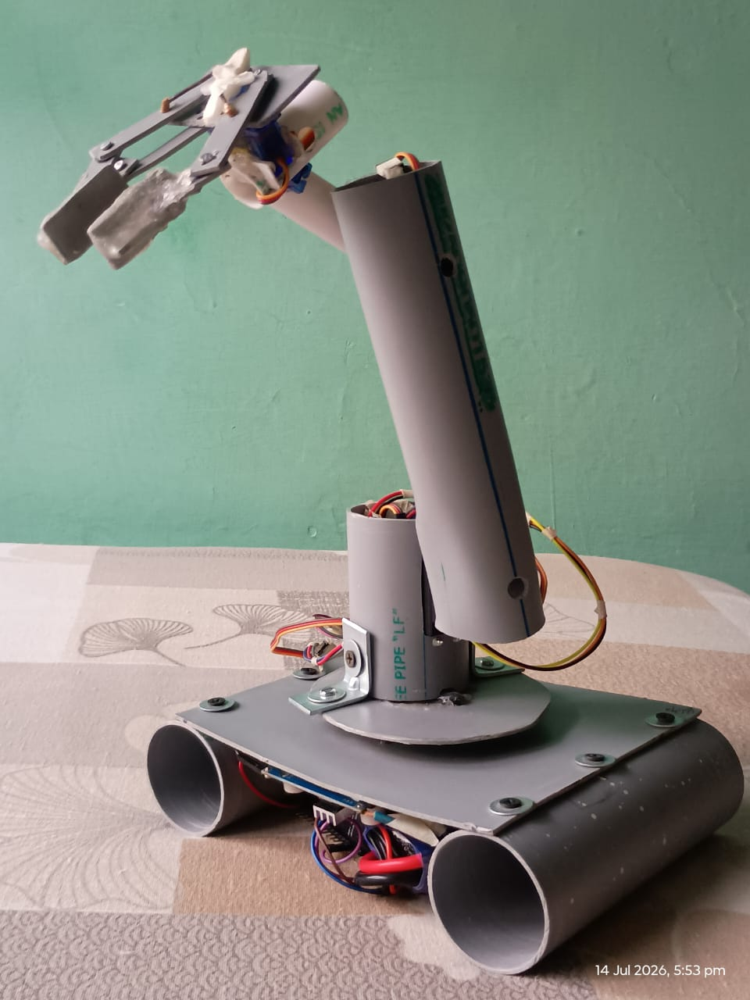
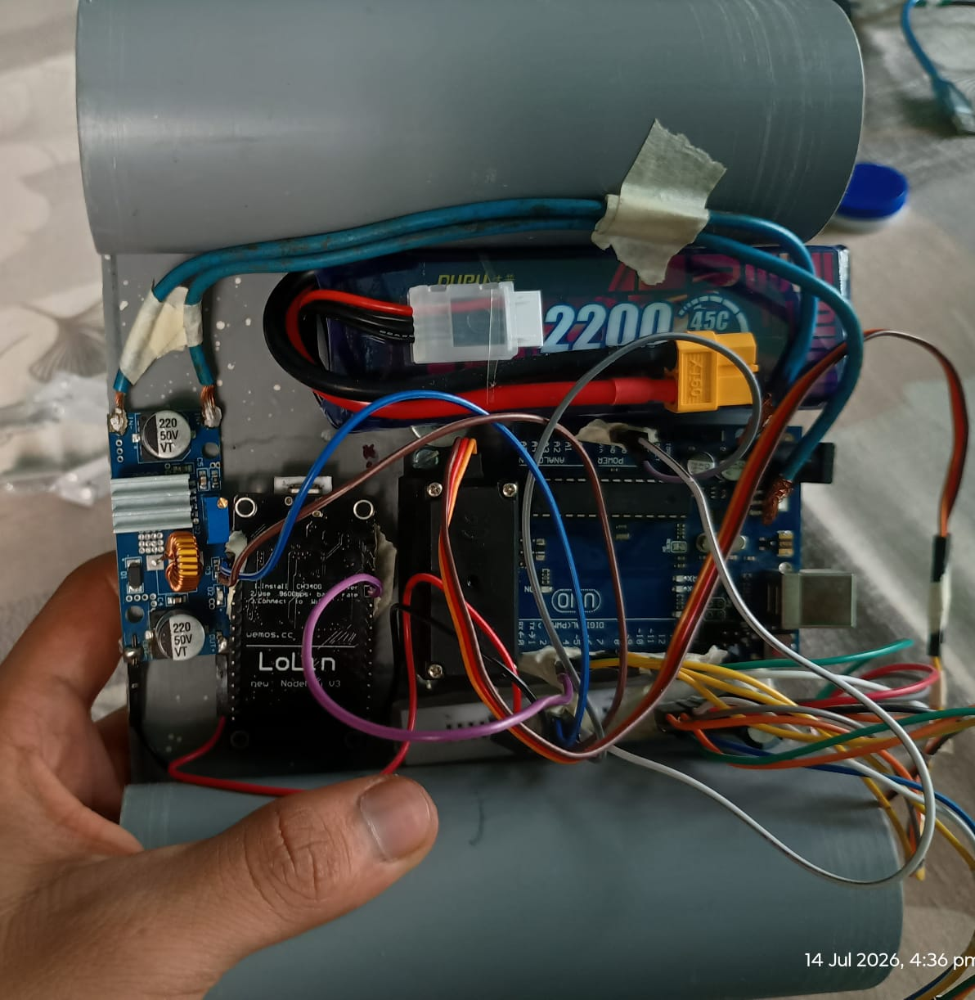
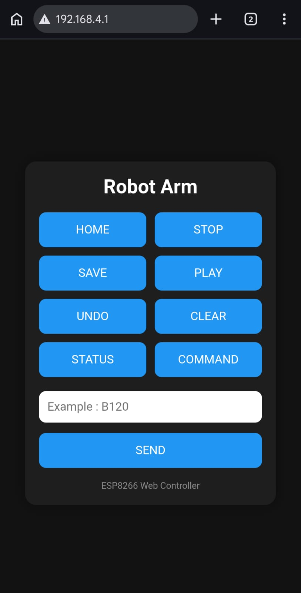

# robotic-arm
i have built my robotic arm from absolute scratch. Here  i will be sharing how i did it with the steps and the code for the arm and will be sharing my journey and whatever modification i make .
It's a 5-DOF Robotic Arm built using Arduino Uno , ESP8266 and Raspberry Pi 5 with smooth motion control, serial communication, and future AI integration.
## Current Progress

 Servo Initialization

 Smooth Motion

 Serial Command Parser

 HOME

 STOP

 Speed Control

 Position Feedback

 Teach Mode

 Replay

 ESP8266 Driven Controller Using WiFi

## Demo

### Robot

### Connections

### Web Interface

 
### Demo Video

INTRODUCTION:

[▶ Watch the Demo](media/videos/introducing-robotic-arm.mp4)
HOME EXPLAINED:

[▶ Watch the Demo](media/videos/home-explained.mp4)

DIRECT COMMAND USING SERIAL MONITOR VERSION (WITHOUT ESP8266 ):

[▶ Watch the Demo](media/videos/direct-command-version.mp4)

COMMAND TEACH MODE (WITH ESP8266 WiFi CONTROLLER):

[▶ Watch the Demo](media/videos/command-teach-mode-explained.mp4)

## Hardware

Arduino Uno

ESP8266

Raspberry Pi 5

5 Servo Motors

External 5V Power Supply

## Commands

B120

S90

E80

W100

G45

HOME

STOP

V15

STATUS

SAVE

UNDO

PLAY

CLEAR

## Future Plans

Python API

Flask Web UI

Camera

OpenCV

AI Integration

